# Architecture Guide: `@klnap/payload-storage-sanity` (A to Z)

This documentation provides a comprehensive technical overview of the architecture, content-addressable deduplication, draft-safe reference retention, server-only Sanity client boundary, and Next.js React Server Component (RSC) integrations implemented in `@klnap/payload-storage-sanity`.

---

## 1. Executive Summary & Design Principles

`@klnap/payload-storage-sanity` integrates the **Sanity storage Sanity Asset Pipeline & Global CDN global CDN** into **Payload CMS 3.0** as a high-performance cloud storage adapter.

### Core Architectural Tenets
1. **Edge-Optimized Media Delivery**: Media binaries are persisted within Sanity's global edge network (`cdn.sanity.io`), delivering real-time image transformations, hotspot/crop coordinates, automatic AVIF/WebP format negotiation, and Low-Quality Image Placeholders (LQIP/blurhash).
2. **Zero HTTP Waterfall Architecture**: Eliminates client-side data fetching waterfalls in the Admin panel. Components such as `MediaUsageInspector` operate strictly as React Server Components (RSC) executing direct Payload Local API queries on the server.
3. **Content-Addressable Binary Deduplication**: Inspects file buffers and computes a SHA1 checksum before performing network uploads. Existing assets with matching hashes are reused immediately ($O(1)$ bandwidth).
4. **Draft-Safe Reference Retention**: The reference detection engine (`findMediaUsage`) executes with `draft: true`. Any media referenced by published records or unpublished draft versions is strictly protected from upstream CDN deletion.
5. **Server-Only Client Isolation**: The Sanity client SDK and mutation tokens remain strictly confined to the server environment, never leaking secrets or API clients into client-side browser bundles.

---

## 2. End-to-End System Architecture

```mermaid
flowchart TD
    subgraph Server-Side Upload Lifecycle
        A[User Uploads File via Admin Form / Local API] --> B[Sanity Storage Adapter: handleUpload]
        B --> C[Compute SHA1 Checksum from File Buffer]
        C --> D{Does SHA1 Exist in Database or Sanity?}
        D -->|Yes: Deduplicate| E[Reuse Existing sanity_id & Metadata]
        D -->|No: New Asset| F[Stream Binary to Sanity Asset API]
        F --> G[Extract Dimensions, Palette, and LQIP Blurhash]
        E --> H[Persist Sanity Fields in Payload Media Document]
        G --> H
    end

    subgraph Server-Side Deletion & Retention
        I[User Deletes Media Document] --> J[beforeDelete Hook]
        J --> K[findMediaUsage with draft: true across ALL Collections]
        K --> L{Inbound References Detected?}
        L -->|Yes: References Exist| M[Abort Deletion & Throw ValidationError]
        L -->|No: Unreferenced| N{Configured Retention Policy?}
        N -->|retain| O[Preserve Asset on Sanity CDN]
        N -->|delete| P[Delete Asset via Server-Side Sanity Client]
    end

    subgraph Inbound Webhook & State Synchronization
        Q[Sanity Webhook Event: asset deleted/mutated] --> R[Verify HMAC SHA256 Signature Header]
        R --> S[Query Matching Media Records via Payload Local API]
        S --> T[Update syncStatus: available / deleted / error]
    end

    subgraph Server Component Media Inspection
        U[Next.js RSC Media Edit View] --> V[MediaUsageInspector Server Component]
        V -->|Payload Local API| W[findMediaUsage: draft: true]
        W --> X[Pass Serializable usages to MediaUsageTableClient]
    end
```



---

## 3. Data Model & Database Optimization

When `@klnap/payload-storage-sanity` is applied to a designated media collection, it enriches the collection schema and database indexes:

### 3.1. Injected Fields
| Field | Type | Description |
|---|---|---|
| `sanity_id` | `text` | Unique Sanity asset identifier (e.g. `image-Tb9Ek...-2000x3000-jpg`). Indexed. |
| `sanity_url` | `text` | Canonical URL pointing to the file on the Sanity CDN. |
| `sanity_hash` | `text` | SHA1 hash of the file buffer used for content-addressable deduplication. Indexed. |
| `sanity_metadata` | `group` | Width, height, aspect ratio, LQIP blur string, and color palette. |
| `syncStatus` | `select` | Availability status: `available`, `syncing`, `deleted`, `error`. |

### 3.2. Database Index Optimization
- **`sanity_hash` Index**: Single-column index enabling sub-millisecond duplicate checks during the upload lifecycle.
- **`[sanity_id, syncStatus]` Compound Index**: Optimizes webhook and reconciliation lookups when synchronizing external CDN events with local database rows.

### 3.3. Content-Addressable Hashing (`crypto.ts`)
Before dispatching a file buffer to Sanity's servers:
```typescript
const hash = crypto.createHash('sha1').update(fileBuffer).digest('hex')
```
The adapter queries the local database for an existing document with the identical `sanity_hash`. If found, network transmission is bypassed completely, saving bandwidth and storage allocation.

---

## 4. Server-First Data Fetching (Zero HTTP Waterfall)

All media usage detection and image transformation URLs are resolved strictly on the server without client-side network roundtrips.

### 4.1. `MediaUsageInspector` Server Component
The media edit view utilizes an async React Server Component (RSC) to inspect document usage across the entire CMS:
```typescript
import { findMediaUsage } from '../queries/findMediaUsage'
import { MediaUsageTableClient } from './MediaUsageTableClient'

export async function MediaUsageInspector({
  id,
  payload,
}: {
  id: string | number
  payload: Payload
}) {
  // Direct Server-Side Query Execution (Zero HTTP Waterfall)
  const usages = await findMediaUsage({
    id,
    payload,
    draft: true,
  })

  // Passes serializable initial data directly to client table
  return <MediaUsageTableClient usages={usages} />
}
```
Client components never perform `fetch('/api/media/usage')` or display initial loading spinners on mount.

### 4.2. Next-Gen CDN URL Generation (`buildSanityImageUrl.ts`)
Image URLs are computed server-side using pure URL parameter builders without external network requests:
```typescript
import { buildSanityImageUrl } from '@klnap/payload-storage-sanity'

const cdnUrl = buildSanityImageUrl(mediaDocument, {
  width: 1200,
  height: 630,
  format: 'webp',
  quality: 85,
  fit: 'crop',
  focalPoint: { x: 0.5, y: 0.5 },
})
```
If the media document has `syncStatus = 'deleted'`, `buildSanityImageUrl` returns `null` safely, preventing broken image links on public storefronts.

---

## 5. Server Actions & Mutations

Mutations, uploads, and deletions strictly enforce server boundaries and database consistency.

### 5.1. Server-Only Sanity Client Boundary
The Sanity client (`@sanity/client`) is instantiated strictly within server-side execution paths (`src/client/createSanityClient.ts`). Configuration options including the `token` parameter are isolated from client bundles, preventing unauthorized administrative access to the Sanity project.

### 5.2. Atomic Deletion & Retention Lifecycle (`retention.ts`)
When a media document deletion is initiated:
1. The `beforeDelete` hook intercepts the operation.
2. Executes `findMediaUsage` across all configured collections with `draft: true`.
3. If references exist in any collection (published or draft), deletion is aborted and a `ValidationError` is thrown to the user.
4. If unreferenced:
   - If `retention: 'delete'`, dispatches an authenticated deletion request to Sanity Asset API.
   - If `retention: 'retain'`, preserves the binary on the CDN while removing the local database row.

### 5.3. Inbound Webhook Processing (`handleEvent.ts`)
- Receives events via `POST /api/sanity/webhook`.
- Authenticates the request using constant-time cryptographic verification of the `sanity-webhook-signature` header via HMAC SHA256.
- Updates matching Payload records using the Local API (`payload.update`), setting `syncStatus = 'deleted'` when an asset is removed upstream.

---

## 6. Configuration & Edge Cases

### 6.1. Draft-Safe Reference Retention
Traditional reference checks only query published documents, creating vulnerabilities where media used in drafts is purged:
- `@klnap/payload-storage-sanity` queries every collection that contains an `upload` field targeting the media collection.
- Enforces `draft: true` on all queries.
- Ensures media linked in draft blog posts, unpublished pages, or draft product variants remains protected.

### 6.2. Upstream Deleted Asset Recovery (`UnavailableAssetRecovery.tsx`)
If an asset is deleted upstream directly within Sanity Studio:
- The webhook marks the Payload record as `syncStatus = 'deleted'`.
- The Admin UI renders the `UnavailableAssetRecovery` diagnostic banner.
- Redactors can replace the underlying file without altering or breaking existing foreign key relationships across other collections.

### 6.3. Custom CDN Base URL Host Rewriting
When enterprise setups utilize custom domain CDNs or Cloudflare edge proxies:
- Configure `cdnBaseUrl: 'https://media.example.com'`.
- The URL generator automatically replaces `https://cdn.sanity.io` with the custom origin while preserving all transformation path parameters.
